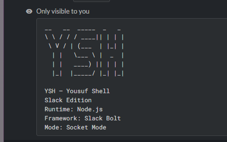
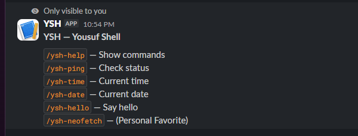

# YSH Slack Bot

YSH — Yousuf Shell, now on Slack.

## Features

- 6 commands
- System information 
- Easter egg 
- Slack-native utilities 
- 24/7 live deployment 

## Examples

### Help 

`/ysh-help`

### System Check 

`/ysh-ping`

### Whatsup 

`/ysh-time`

`/ysh-date`

### Greeting 

`/ysh-hello`

### Try Once 

`/ysh-neofetch`

